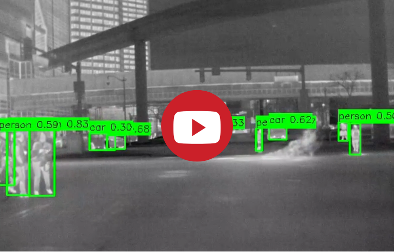

# YOLO-Object-Detection-for-ADAS

## Project Overview

Welcome to the YOLO-Object-Detection-for-ADAS repository! This project focuses on developing an advanced object detection system for Advanced Driver Assistance Systems (ADAS) using the YOLOv5 model. By leveraging thermal imaging, this system enhances object detection capabilities in low-visibility conditions, making it a crucial component for the safety and efficiency of autonomous vehicles.

## Demo

[](https://youtu.be/bBrrJp9xdi4)


## Full Project Description

For a comprehensive overview of the project, including all steps, methodologies, and results, refer to the detailed project description/report:

- `Object Detection for ADAS.ipynb`: Full project description/report, including everything about the project.


## Features

- **Thermal Image Processing:** Utilizes thermal images to detect objects in challenging environments with low visibility.
- **YOLOv5 Model:** Implements the state-of-the-art YOLOv5 model for real-time object detection.
- **Custom Dataset:** Trained on a custom thermal image dataset tailored for ADAS applications.
- **Evaluation Metrics:** Comprehensive evaluation using confusion matrix, precision-recall curves, F1-confidence curves, and more.
- **Inference Pipeline:** Demonstrates practical application through inference on new thermal images with visualized results.

## Project Structure

- `YOLO preprocessing.ipynb`: Contains the preprocessing code to convert annotations into YOLO format.
- `dataset/`: Directory containing the dataset in YOLO format.
- `yolov5/Object detection.ipynb`: Notebook for training the YOLOv5 model.
- `Object Detection for ADAS.ipynb`: Full project description/report, including everything about the project.
- `data_test/`: Directory containing test images used to test the model.
- `Object detection demo video.mp4`: Demo video of the object detection system.

## Getting Started

### Prerequisites

Ensure you have the following installed:
- Python 3.7+
- PyTorch
- OpenCV
- Matplotlib
- Jupyter Notebook

### Installation

1. Clone the repository:
   
   ```bash
   git clone https://github.com/your-username/YOLO-Object-Detection-for-ADAS.git
   cd YOLO-Object-Detection-for-ADAS

3. Install the required packages:
   
   ```bash
   pip install -r requirements.txt

### Create a data.yaml File

Create a data.yaml file in the yolov5 directory with the following content, adjusting paths as necessary:

```bash
train: ../dataset/images/train
val: ../dataset/images/val

nc: 10  # number of classes
names: ['person', 'bike', 'car', 'motor', 'bus', 'train', 'truck', 'scooter', 'other_vehicle', 'background']
```

### Data Preprocessing

1. Download the FLIR dataset and place the index_train and index_val files in the root directory.
2. Pass the train and test set paths to the preprocessing notebook mentioned below.
3. Run the preprocessing notebook to convert annotations into YOLO format:

   ```bash
   jupyter notebook "YOLO preprocessing.ipynb"
   ```
   
### Model Training

Navigate to the yolov5 directory and open the training notebook:

```bash
cd yolov5
jupyter notebook "Object detection.ipynb"
```

Follow the instructions in the notebook to train the model using the provided dataset.

### Running Inference on Test Images

You can also use the provided script in the Object Detection for ADAS.ipynb to perform inference on the test images in the data_test directory. The results will be saved in the output_images_test_set directory.

## Future Work

1. **Enhance Dataset:**
   - Augment the dataset with more examples, especially for underrepresented classes like 'motor' and 'bus'.

2. **Use a More Powerful GPU:**
   - A GPU with higher memory (e.g., RTX 2080, RTX 3080) can significantly reduce training time and allow for higher batch sizes and more epochs.

3. **Tune Hyperparameters:**
   - Experiment with different learning rates, batch sizes, and other hyperparameters to optimize model performance.

4. **Class-specific Confidence Thresholds:**
   - Implement class-specific confidence thresholds to balance precision and recall better.

## Contributions

Contributions are welcome! Please feel free to submit issues, fork the repository, and send pull requests.


